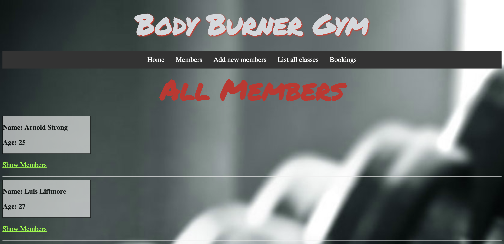

# Project Brief

## Body Burner Gym

A local gym has asked you to build a piece of software to help them to manage memberships, and register members for classes.

_Body Burner Gym App - Homepage_

_Body Burner Gym App - Members page_

_Body Burner Gym App - Add New Member page_

_Body Burner Gym App - All Gym Sessions_

_Body Burner Gym App - Booking page_

## Inspired By

[Glofox](https://www.glofox.com/club-solution/), [Pike13](https://www.pike13.com/pike13-scheduling-software-demo)

## Caution

You might try to create a Ruby class named `Class` - this is a reserved word in Ruby, so you will have to name your class `GymClass`, or similar.

## User Stories / Acceptance Criteria - MVP

## Manage Membership

_As a gym manager_  
_I want to manage the list of members_ 
_So that I am storing up-to-date information about members_ 

**Acceptance Criteria:** Gym managers should be able to create members 
**Acceptance Criteria:** Gym managers should be able to edit members 

## Manage Classes

_As a gym manager_ 
_I want to manage the list of classes_ 
_So that I have up to date information about what classes are available_ 

**Acceptance Criteria:** Gym managers should be able to create classes 
**Acceptance Criteria:** Gym managers should be able to delete classes 

#### Register Users for Classes

_As a gym manager_ 
_I want to be able to add a user to a class_ 
_So that I can book their place_ 

**Acceptance Criteria:** Gym managers should be able to assign members to classes.

## View all customers assigned to a class

_As a gym manager_ 
_I want to view all members assigned to a class_ 
_So that I can see which classes are going to be busy_ 

**Acceptance Criteria:** Gym managers should be able to view a list of classes, and see the members that will be attending that class.

## User Stories - Possible Extensions

## Classes should have a maximum capacity

_As a gym manager_ 
_I want to be able to assign a maximum capacity to a class_ 
_So that the class can't be over-booked_ 

**Acceptance Criteria:** Gym managers should be able to give each class a maximum capacity 
**Acceptance Criteria:** Gym managers should not be able to assign members to a class that is already full. (At capacity)

## Premium Membership

_As a gym manager_ 
_I want to be able to mark members as having "Premium Membership"_ 
_So that I can maximise revenue_ 

**Acceptance Criteria:** Gym managers will be able to assign premium membership to members 
**Acceptance Criteria:** Gym managers will be able to assign a time to a class  
**Acceptance Criteria:** Gym managers will only be able to assign premium members to classes that take place during peak hours. (7-9am, 5-8pm)

# How to run the Project

_To run this you will need to have SQLPostgres and Sinatra installed._ 

_Have 3 Terminal windows open._

_Window 1 - Navigate to the 'db' folder and type 'psql -d body_burner_gym -f members.sql'_
_Then type 'psql -d body_burner_gym'_

_Window 2 - Navigate to the 'db' folder and type 'ruby seeds.rb'_

_Window 3 - Navigate to the home folder 'body_burner_gym' and type 'ruby app.rb' This will then open up_ _the app in the browser. IF not then then type into the browser 'localhost:4567'_
